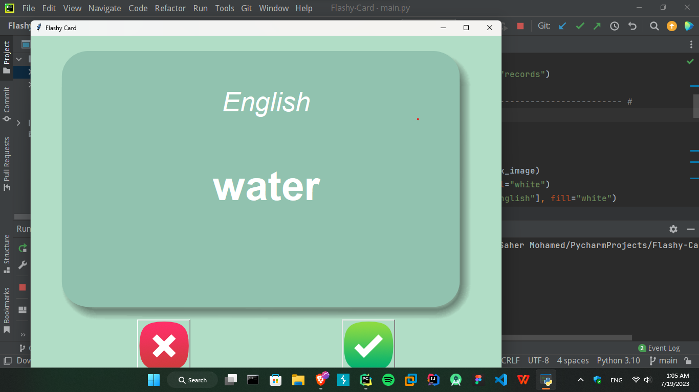

# Flashy Card
This is a Python project that implements a flashcard application using the tkinter library. The application allows users to learn and practice foreign language vocabulary. The flashcards display a French word and the user needs to guess the corresponding English translation. The user can flip the card to reveal the correct translation and mark whether they knew the word or not.

## Features
- Loads flashcard data from a CSV file.
- Displays a random flashcard with a French word.
- Allows flipping the flashcard to reveal the English translation.
- Provides buttons to mark if the user knew the word or not.
- Removes known words from the flashcard deck and saves the progress.

## Prerequisites
Make sure you have the following installed:
  - Python 3.x
  - `pandas` library

## Installation
1. Clone the repository:
    ```commandline
    https://github.com/SaherMuhamed/Flashy-Card.git
    ```

2. Navigate to the project directory:
    ```commandline
    cd flashy-card
    ```

3. Install the required dependencies using pip:
    ```commandline
    pip install pandas
    ```

## Usage
1. Prepare the flashcard data:
   - Create a CSV file named words_to_learn.csv in the data directory.
   - The CSV file should contain two columns: French and English.
   - Populate the CSV file with the French and English word pairs you want to learn.

2. Run the application:
    ```commandline
    python main.py
    ```

3. The flashcard window will open, displaying a French word.
4. Try to guess the corresponding English translation.
5. Click the "Right" button if you knew the word, or the "Wrong" button if you didn't know.
6. The next flashcard will be displayed.
7. Repeat the process until you have learned all the words or exit the application.

## Screenshots


